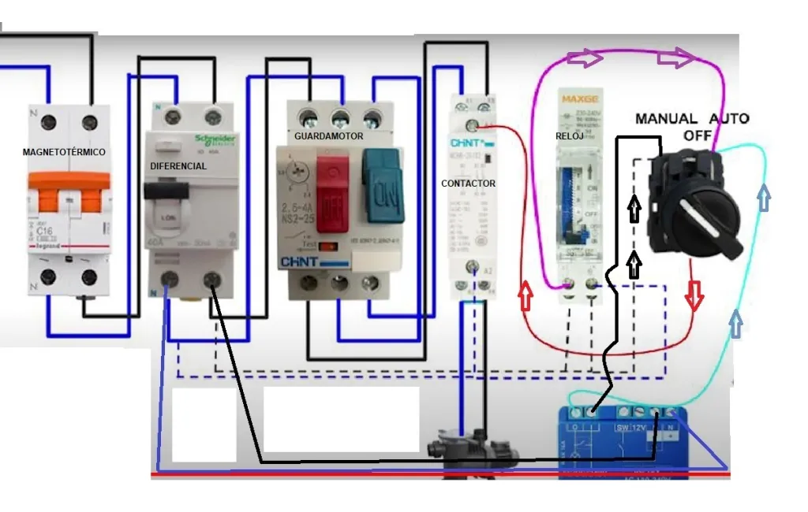
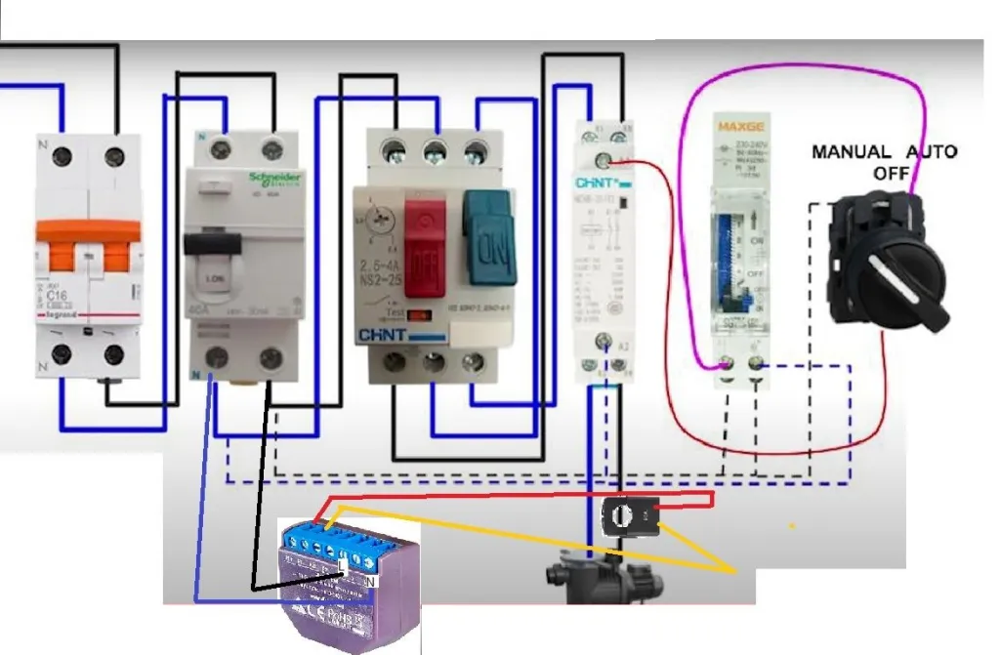

# Domotizar-la-piscina
Domotizar la piscina, sin tocar nada de la instalación original.

Con la ayuda de “Un loco y su tecnología” y su estupendo vídeo, es muy fácil domotizar la piscina, sin tocar nada
de la instalación original. De esta manera puedes manejarla desde el móvil, home assistant, etc, o simplemente
de la manera habitual.
He hecho unos gráficos para entenderlo mejor.

---
## Foco Relé Shelly 1

## Motor Relé Shelly Plus 1

## Medidor de consumo Shelly EM + 1 pinza. 
La pinza se conecta a la fase.

Una vez lo tenemos todo conectado, solo hay que integrar los relés y el medidor con la aplicación que usemos.
